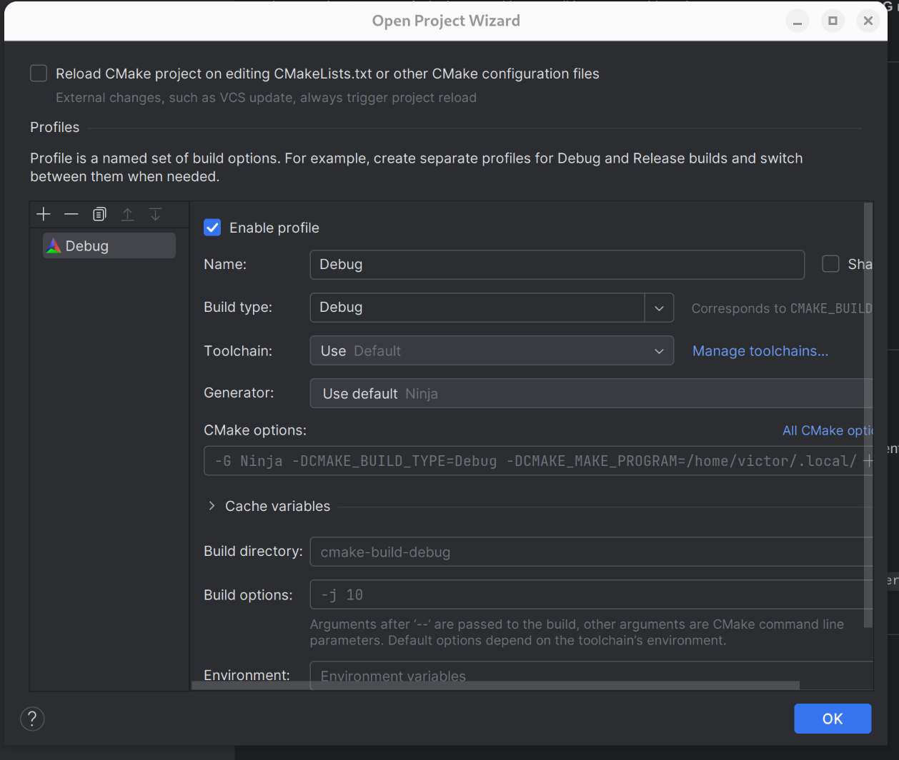
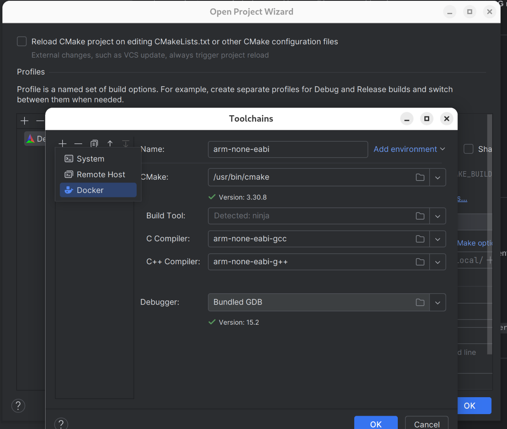
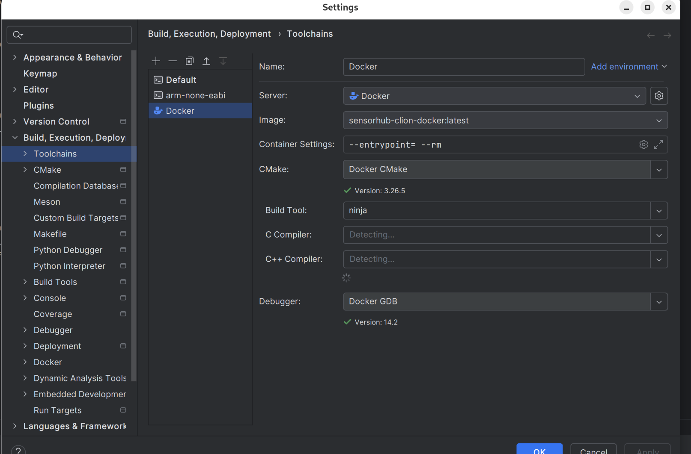
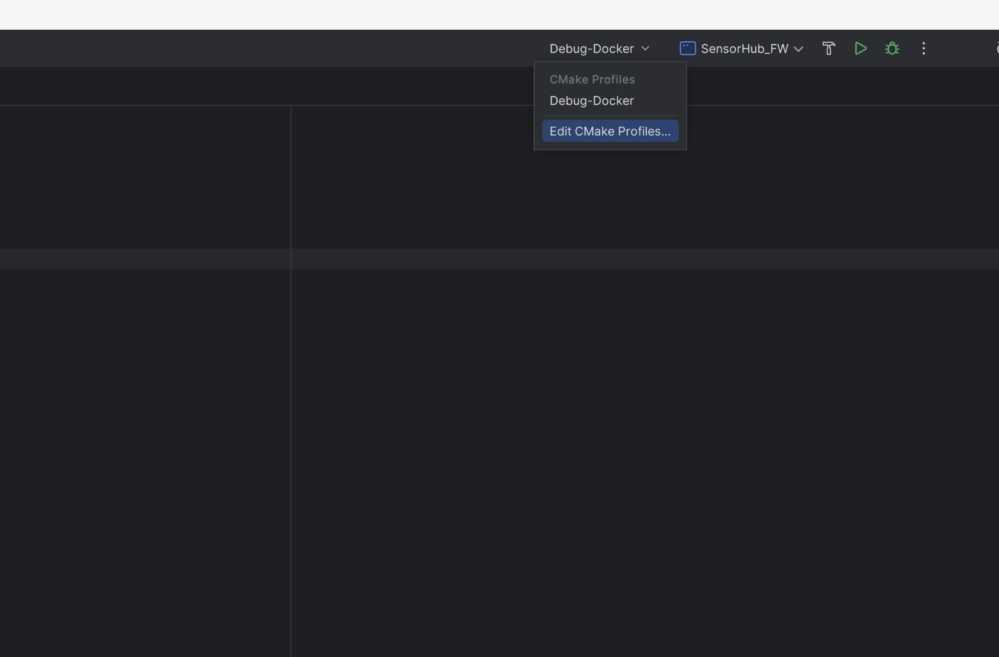
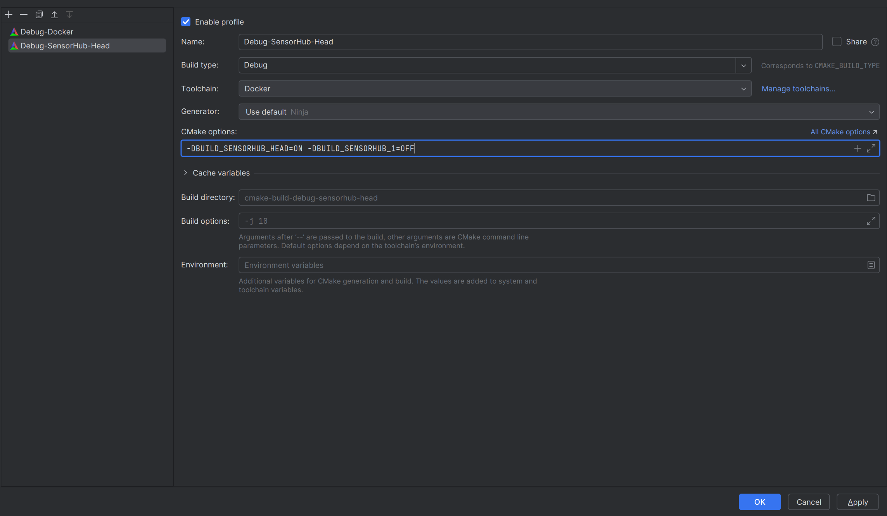

# Developing with CLion

## 1. Prerequisites

* Install [**Docker**](https://www.docker.com/get-started/) and [**CLion**](https://www.jetbrains.com/clion/download/) on your system.

---

## 2. Build the Docker image

Open a terminal and run:

```bash
git clone https://github.com/RobotPatient-Research/SensorHub.git
cd SensorHub/firmware/.devcontainer
```

Then build the docker-image that is needed for clion to run the toolchain:

```bash
docker build -f Dockerfile -t sensorhub-clion-docker .
```

---

## 3. Open the project in CLion

* Open the `firmware` folder in CLion.

---

## 4. Set up the Docker toolchain

1. Go to **File → Settings → Build, Execution, Deployment → Toolchains** (or select **Manage Toolchains**).
   

2. Click the **`+`** button in the top-left corner and select **Docker**.
   

3. Configure it as follows:

   * **Image:** `sensorhub-clion-docker:latest`
   * **Build tool:** `ninja`
     

---

## 5. Build the project

* Once the toolchain is configured, let CLion index and configure the project.
* Click the **Build** button to build the firmware.

---

## 6. Changing the build target

To build for different hardware targets:

1. Click on the current CMake profile (e.g., `Debug-Docker`) and select **Edit CMake Profiles**.
   

2. Add a new profile and include the appropriate compile options (e.g., `-DBUILD_...`).
   
