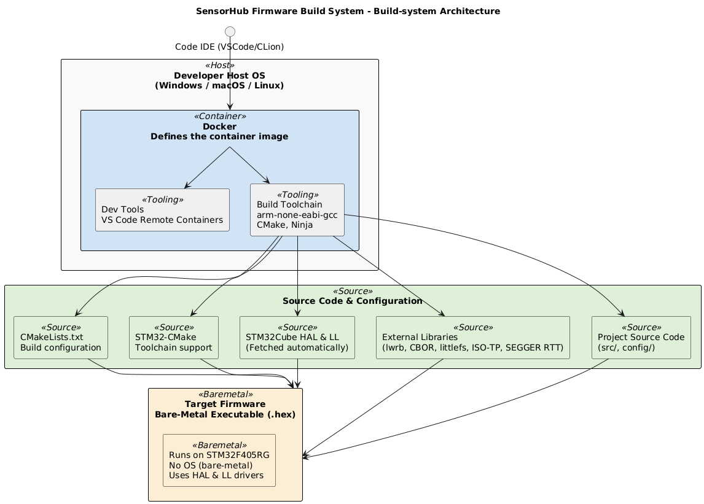

# Build Overview

This document explains **why** certain design decisions were made (Rationale) and **how** the current build system is structured (Overview).

---

## Current Build System Overview

### Components

**`.devcontainer/`**

Defines a Docker image with:

  * `arm-none-eabi-gcc` cross-compiler
  * `CMake` and build tools
  * Helpful extensions for debugging
* Ensures identical toolchains for everyone.

**`stm32-cmake`**

Provides CMake support for STM32:

  * Auto-fetches STM32Cube HAL and CMSIS
  * Sets up linker scripts, startup files, and device headers
  * Generates .elf and size reports.

**External Libraries**

Pulled automatically with CMake `FetchContent`:

  * `SEGGER RTT` for logging
  * `littlefs` for onboard flash storage
  * `ISO-TP` for CAN protocol support
  * `CBOR` for data encoding
  * `Manikin Software Libraries` for sensor & flash drivers

**Project Structure**

```
.
├── .devcontainer/         # VS Code & Docker dev environment
├── config/                # Board and system configurations
├── external/              # Third-party libraries (pulled automatically)
├── src/                   # Core firmware logic (sampling, CAN, storage, CLI)
├── CMakeLists.txt         # Main build configuration
```

---
This folder structure was chosen after a few rounds of refactoring. As complexity adds up quickly and the files that are changed most of the time are the `Core firmware logic (aka business logic)` files and the `board_config.h` header. Most of the other sources are used to define the toolchain, startup and hal-drivers. Which are seperately put into the `config/` directory, to make sure that the project is manageable.

Another thing to mention about this folder structure is that most drivers which are crucial for acquisition (think about timers, error-handling, sensor-drivers, flash-drivers and basic types) are inside [a seperate git-repository](github.com/RobotPatient/Manikin_Software_Libraries_V3). As these libraries need a lot of testing, seperating them makes testing, CI and maintenance way easier and targeted. 


## Rationale (Architecture Decision Records)

### ADR-001: Use Development Container (`.devcontainer`) and Docker

**Status:** Accepted

**Context:**

* Developers work on different host platforms (Windows, macOS, Linux).
* STM32 GCC toolchains and dependencies can be error-prone and inconsistent to install locally.
* Consistency and reproducibility are critical for embedded builds.

**Decision:**

* A Docker image defines the complete development environment.
* `.devcontainer` configures this for VS Code **Remote Containers**, making it easy to start coding with zero local setup.

**Consequences:**

* All developers build and debug with the same toolchain.
* Builds are portable and reproducible.
* Local environment conflicts are eliminated.

---

### ADR-002: Use STM32 HAL and Low-Layer Drivers for Bare-Metal

**Status:** Accepted

**Context:**

* The firmware runs without an operating system for maximum control and minimal overhead.
* STM32Cube HAL provides vendor-maintained drivers for peripherals and startup code.

**Decision:**

* Use the STM32Cube HAL and LL drivers to configure and access hardware peripherals (USB, CAN, SPI, GPIO, etc.).

**Consequences:**

* Developers benefit from proven, tested drivers.
* Peripheral configuration is simpler and aligns with STM32CubeMX tooling.
* Fine-grained control is possible when needed using LL APIs.

---

### ADR-003: No RTOS

**Status:** Accepted

**Context:**

* The firmware requirements are simple: periodic sensor sampling, CAN bus communication, USB data transfer.
* Adding an RTOS would increase complexity and resource usage unnecessarily.

**Decision:**

* Implement a bare-metal main loop without an operating system.

**Consequences:**

* Simpler build and smaller binary size.
* Deterministic execution with manual concurrency handling.
* Limited scalability for more complex scheduling needs.

---

### ADR-004: Use CMake as the Build System

**Status:**  Accepted

**Context:**

The SensorHub firmware is an embedded project targeting the STM32F405RG microcontroller. Building bare-metal firmware requires managing:

* Compiler flags for C, C++, and assembly files
* Linker scripts, startup files, and device headers
* External dependencies (STM32 HAL, LL drivers, USB middleware, third-party libraries like SEGGER RTT, littlefs, CBOR, ISO-TP)
* Different board configurations (SensorHub1, SensorHub Head)
* Cross-platform toolchain support for developers using Windows, macOS, or Linux

Historically, embedded STM32 projects often used IDE-specific build systems (e.g., STM32CubeIDE, IAR EWARM, or Makefiles). However, these solutions:

* Are not portable across OSes
* Are hard to automate for CI/CD
* Lack modern dependency management
* Become fragile as the project grows.

**Decision:**

We will use **CMake** as the build system for this firmware project.
Specifically:

* Use the [stm32-cmake](https://github.com/ObKo/stm32-cmake) module to handle STM32-specific setup (toolchain, HAL, CMSIS, startup files, and linker scripts).
* Use CMake’s `FetchContent` to automatically pull and version-lock external libraries (HAL, USB middleware, third-party libraries).
* Integrate easily with modern development tools, including the `.devcontainer` and VS Code extensions.

**Consequences:**

**Cross-platform**: Developers on Windows, macOS, and Linux can build identically using the same CMake configuration inside Docker.

**Maintainable**: Dependency versions and toolchain settings are declarative and version-controlled.

**IDE-independent**: Developers can choose their preferred editor or build entirely in CI/CD pipelines.

**Scalable**: Multiple board configurations and modular targets are easily managed with modern CMake idioms.

**Future-proof**: CMake is widely supported, actively maintained, and integrates well with other tooling (testing, static analysis, packaging).

**Alternatives Considered**

* **Makefiles**: Simple but fragile for growing projects with multiple configurations and external dependencies.

* **Vendor IDE (STM32CubeIDE)**: Not portable, locks developers to a specific IDE, harder to script or integrate in headless CI/CD.

* **PlatformIO**: Popular for hobby projects but less flexible for precise control over STM32 HAL and linker scripts, and overkill for bare-metal with complex vendor libraries.


**Chosen:** Use **CMake** with `stm32-cmake` for a robust, portable, and modern build system.

---

### ADR-005: Use `stm32-cmake` instead of STM32Cube’s official CMake support

**Status**: Accepted

**Context**

STM32 firmware builds require correct setup for:

* Toolchain configuration for ARM GCC
* Startup files, linker scripts, and vector tables
* Vendor HAL, LL drivers, and middleware (e.g. USB Device stack)
* Board-specific configurations
* Flexible build options for multiple firmware variants

Historically, STM32Cube projects relied on IDEs (STM32CubeIDE, Keil, IAR) with autogenerated Makefiles or project files.
**Recently, STM32Cube added official CMake support** in some HAL packages (via `.cmake` files generated by CubeMX or included in Cube firmware packs).

However, the built-in STM32Cube CMake support:

* Is **incomplete**, as not all middleware (e.g. USB, BSP) is structured as modular CMake targets.

* Generates boilerplate CMake output that’s not very idiomatic or maintainable.

* Tends to assume IDE usage alongside CMake (CubeIDE or STM32CubeMX).

* Is harder to version-lock or update cleanly inside a container or CI/CD pipeline.

**Decision**

We will use [`stm32-cmake`](https://github.com/ObKo/stm32-cmake) instead of the STM32Cube built-in CMake modules.

Reasons:

- **Full CMake-native approach:** `stm32-cmake` cleanly wraps HAL, LL, middleware, and startup files as modular CMake targets.

- **Version control:** Uses CMake’s `FetchContent` to fetch the correct HAL version automatically.

- **Toolchain consistency:** Provides a tested GCC toolchain file (`stm32_gcc.cmake`) that works cross-platform inside Docker.

- **Minimal boilerplate:** Reduces custom linker and startup code maintenance.

- **Proven in practice:** Community-maintained and widely adopted in STM32 open-source projects.

**Consequences**

- Faster onboarding — developers don’t have to handle raw STM32Cube-generated CMake or legacy Makefiles.

- Works seamlessly in Docker dev containers and headless CI/CD.

- Keeps the build idiomatic for modern CMake workflows.

- Easy to swap or upgrade HAL versions as needed.

**Alternatives Considered**

* **STM32Cube’s built-in CMake:** Works for basic HAL usage, but doesn’t modularize all middleware, and generates non-idiomatic CMake. Limited community adoption so far.

* **Manually maintained CMake:** Higher effort and risk of subtle errors; more fragile across MCU variants.

**Chosen:** Use `stm32-cmake` for a more robust, developer-friendly CMake build that plays nicely with Docker, VS Code dev containers, and modern CI/CD pipelines.

